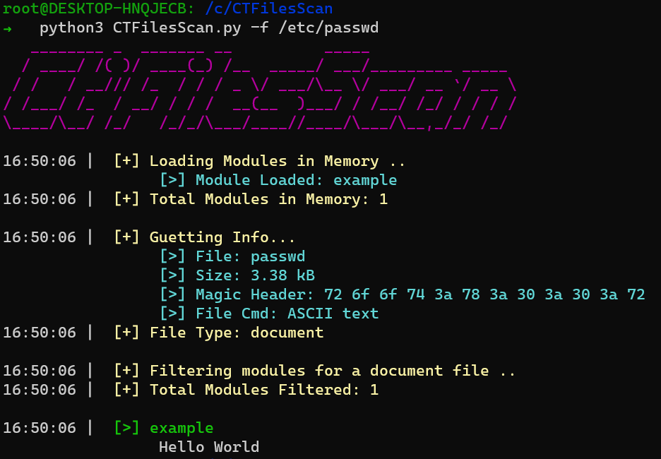

# CTFileScan
This tools is used to scan automatically ctf files.



# Classic Installation :

```bash
git clone https://github.com/Vozec/CTFilesScan.git
cd CTFilesScan
chmod +x setup.sh
./setup.sh
```

# Commands :

```bash
usage: CTFilesScan.py [-h] -f FILE [-p] [-i IV] [-m MODULE] [-l FORMATFLAG] [-j] [-o OUTPUT]

This tools is used to scan automatically ctf files.

options:
  -h, --help            show this help message and exit
  -f FILE, --file FILE  File paths
  -p, --password        Password
  -i IV, --iv IV        IV in hex
  -m MODULE, --module MODULE
                        Select a specific module
  -l FORMATFLAG, --formatflag FORMATFLAG
                        Format Flag (default: 'flag{')
  -j, --json            Use json mode (quit+result formated)
  -o OUTPUT, --output OUTPUT
                        Select directory to save result
```

# Usage :
```bash
python3 -f example.docm -p admin123 -l "flag{" -o /home/user/
```

# Config Creation : 

### Requirement :

``2 Functions:``
- help()
- scan(config)

**help() Example** :
```python
def help():
	config = {
		'type':{'document':['.py','.txt']},
		'linux':True,
		'windows':True,
		'name':'example_config'
	}
	return config
```

**scan() Example** :
```python
def scan(config):
	## Analysis stuff
	result = "Hello World"
	return result
```

All ``configurations`` must to be add in the **modules** directory

All ``setup_NameModule.sh`` must to be placed in **installation** directory
